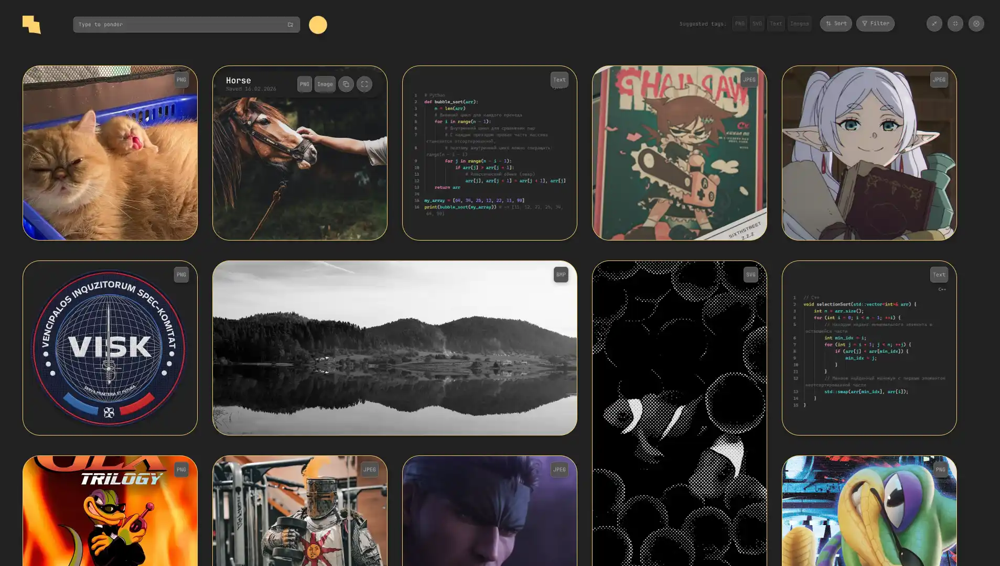

# Splatera

Локальный менеджер ассетов и компонентов на основе визуальной сетки (Masonry). Структурирует файлы по тегам, а не по директориям.

  <figcaption align = "center"> Прототип Интерфейса </figcaption>

## Функционал

- Masonry-сетка. Интерфейс - набор картинок и карточек
- Drag & Drop импорт объектов (Сохранение ссылок на локальные объекты)
- Теггинг вместо директорий. Один файл может иметь несколько тегов
- Quick Preview и быстрое копирование на карточке
- Сортировка визуальный ассетов по цвету

### Юзеркейс

1. Пользователь работает над проектом, ему нужна коллекция референсов
2. Пользователь перекидывает файл или набор файлов в окно программы. Им задаётся тег по типу файла и ручной, по желанию пользователя
3. Формируется стена из ассетов, которые при этом можно фильтровать по типу файла, цвету. Даже если они в разных локальных директориях.

